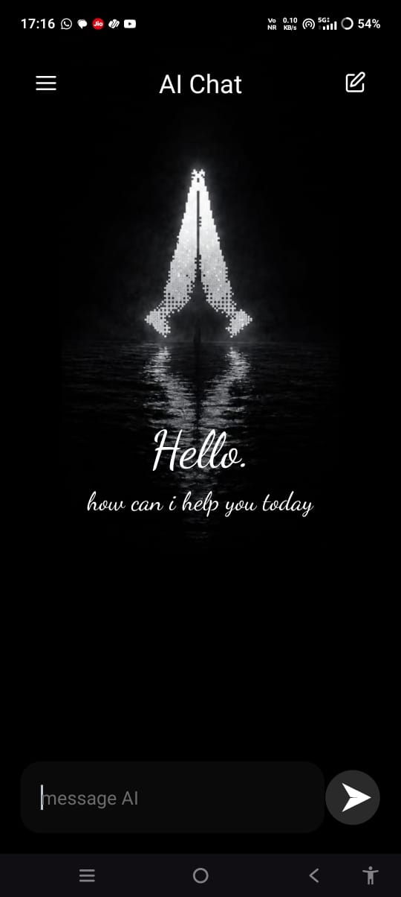
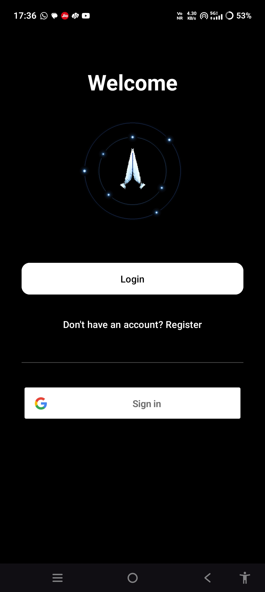
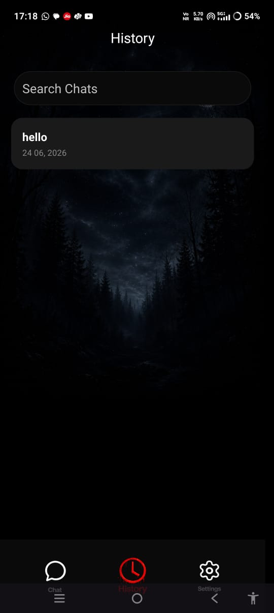
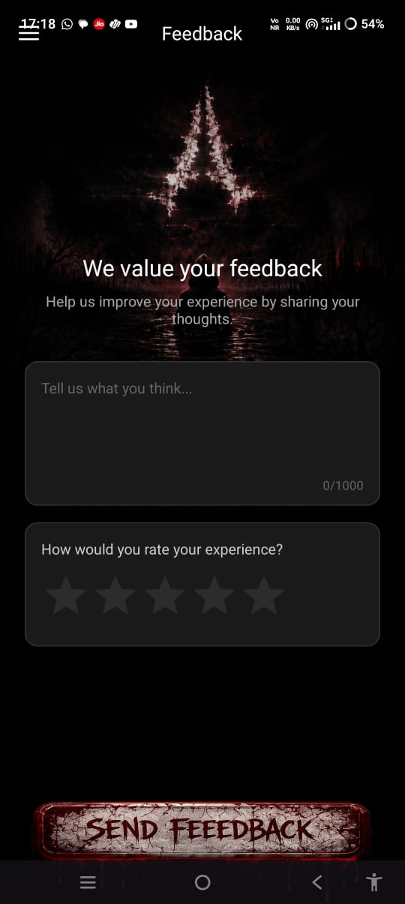
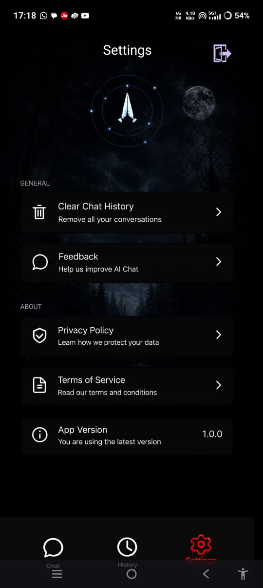

# 🖤 AI Chatbot


### 🌙 AI-Powered Horror-Themed Android Chatbot

An immersive Android AI chatbot featuring intelligent conversations, chat history management, in-app feedback, and a dark fantasy inspired user interface.

---

## 🔗 Quick Links

### 📱 Download APK

[](https://github.com/aditygarg732-ctrl/AiChatBot/releases)

### 💻 Source Code

[📂 View Repository](https://github.com/aditygarg732-ctrl/AiChatBot)

### 👨‍💻 Developer

**Adity Garg**
B.Tech Computer Science & Engineering
MNNIT Allahabad

---

## 📑 Table of Contents

* Overview
* Features
* Tech Stack
* Installation
* Future Improvements
* License

---

## 📱 Overview

This is a modern Android AI chatbot application built using Kotlin, Firebase, and Gemini AI.

The application combines intelligent AI conversations with a horror-inspired dark user interface to create a unique and immersive chatting experience. Users can interact with the AI, access previous conversations, submit feedback, and enjoy a visually engaging dark fantasy themed environment.

---

## ✨ Features

### Home Screen



### 🤖 AI-Powered Conversations

* Real-time AI responses
* Natural language conversations
* Smooth messaging experience
* Fast response rendering


### User Authentication system

* Authentication via-
* google
* Email/password

### User Authentication



### 💬 Chat History Management

* Automatic chat saving
* Access previous conversations
* Continue old chat sessions
* Organized conversation history

### Chat History



### 📂 History Viewer

* Dedicated history screen
* Easy navigation through saved chats
* Quick conversation retrieval


### 📝 In-App Feedback System

* Users can submit feedback directly from the application
* Suggestions and improvement requests
* Helps improve future releases

### Feedback Screen




### ⚙️ Settings Panel

* Privacy Policy
* Terms of Service
* App Information
* User Settings

### Settings




### 🌑 Horror Dark Theme

* Dark fantasy inspired design
* Horror-themed visual elements
* Atmospheric user experience
* Custom UI assets
* 

### ⚡ Performance

* Optimized RecyclerView implementation
* Smooth scrolling
* Fast loading times
* Responsive user interface


---

## 🛠 Tech Stack

### Frontend

* Kotlin
* XML Layouts
* RecyclerView
* Material Design Components

### Backend

* Firebase

### AI Integration

* Gemini AI API

### Development Tools

* Android Studio
* Git
* GitHub


---

## 🚀 Installation

### APK Installation

1. Download the latest APK from the Releases section.
2. Install the APK on your Android device.
3. Open the application.
4. Start chatting with the AI assistant.

### Build from Source

```bash
git clone https://github.com/aditygarg732-ctrl/AiChatBot.git
```

Open the project in Android Studio and run it on an emulator or physical device.

---

## 🔮 Future Improvements

* Voice Chat Support
* AI Personality Modes
* Cloud Synchronization
* Multiple Horror Themes
* Enhanced Animations
* Multi-Language Support
* Export Chat History

---

## ⭐ Support

If you like this project:

* ⭐ Star the repository
* 📝 Share feedback
* 🚀 Suggest new features
* 🐛 Report bugs

---

## 📄 License

This project is licensed under the MIT License.

---

## 🌙 Project Vision

*"Every wish has a cost. Every conversation hides a mystery."*

The objective behind this project is to combine modern AI technology with a dark fantasy inspired user experience, creating an application that feels intelligent, immersive, and visually distinctive.
